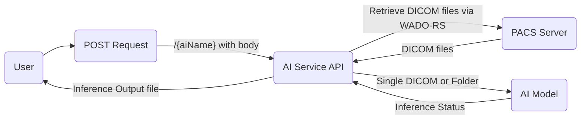
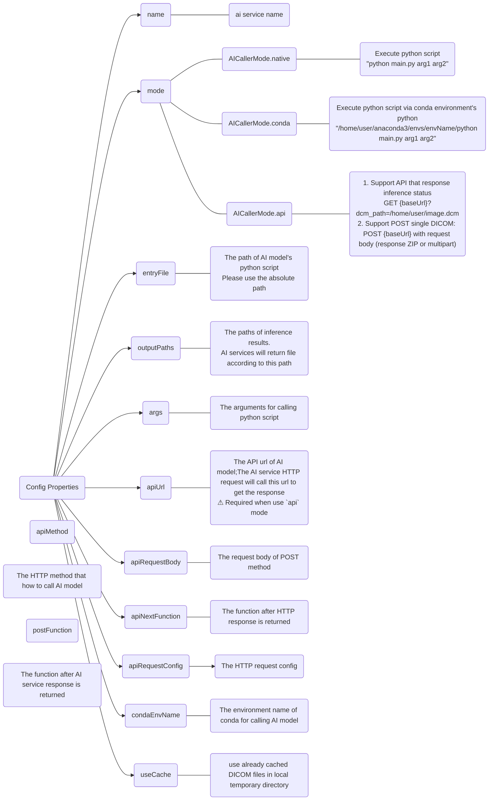
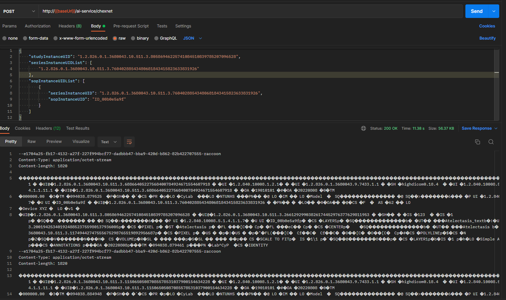
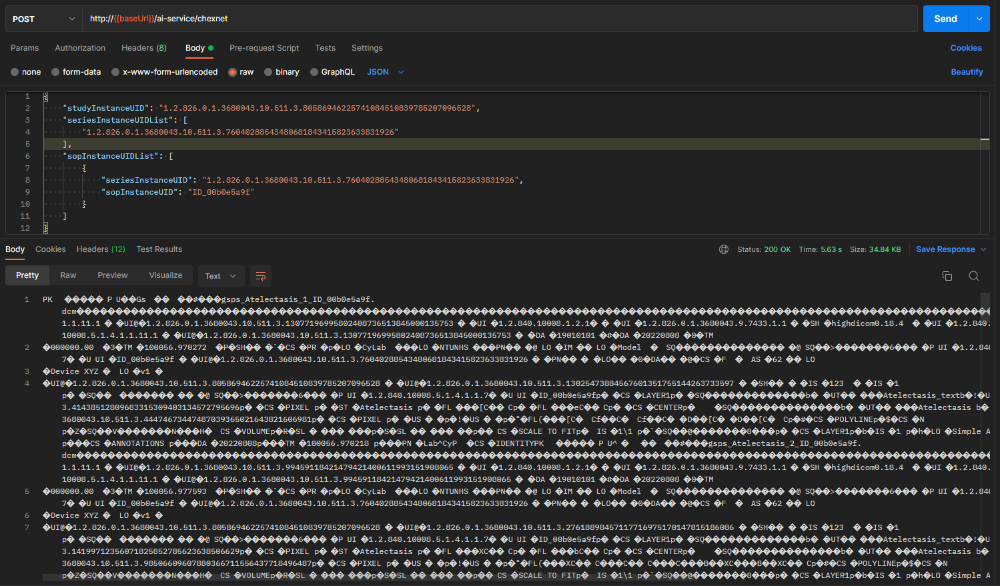

# DICOM-AI-Service
The DICOM AI service use DICOMweb to retrieve DICOM files with specific StudyInstanceUID, SeriesInstanceUID and SOPInstanceUID from PACS, and use the responded contents such as DICOM file or series directory for calling specific AI model and finally get the inference output of AI model.

# Process flowchart
## AI-Service flowchart


# Configuration
<details>
    <summary>Mermaid visualization configuration</summary>


</details>

property name | type | description
---------|----------|---------
 name | string | ai service name
 mode | [AICallerMode](#aicallermodel) | The mode for how to call AI model
 entryFile | string | The path of AI model's python script. Please use the absolute path
 outputPaths | string[] | The paths of inference results.<br>AI services will return file according to this path<br>Support the wildcard path. e.g. /home/user/*.dcm
 args |  string[]  | The arguments for calling python script<br>⚠ Required when use `native`, `conda` mode
 apiUrl |  string  | The API url of AI model;The AI service HTTP request will call this url to get the response<br>⚠ Required when use `api` mode
 apiMethod | "GET" \| "POST" | The HTTP method that how to call AI model<br>ℹ For `api` mode, default: "GET"
 apiRequestBody | string\|JSON | The request body of POST method<br>❗❗ Working in progress<br>ℹ For `api` mode and `POST` method<br>string: read file from this string and embed it into FormData, field name: "file"<br>JSON: POST the JSON body
 apiNextFunction | (response: [AxiosResponse](https://axios-http.com/docs/res_schema)<any, any>, aiArgs) => void | The function after HTTP response is returned<br>ℹ For `api` mode
 apiRequestConfig | [AxiosRequestConfig](https://axios-http.com/docs/req_config) | The HTTP request config<br>ℹ For `api` mode
 condaEnvName | string | The environment name of conda for calling AI model<br>ℹ For `conda` mode
 useCache | boolean | Use already cached DICOM files in local temporary directory
 postFunction | Function | The function after AI service response is returned
 customCmd | string | The custom command string, use when no any mode for your use case

## AICallerModel
name | description 
---------|----------
 native | Execute python script: "python main.py arg1 arg2"
 conda | Execute python script via conda environment's python<br>"/home/user/anaconda3/envs/envName/python main.py arg1 arg2" 
 api | 1. Support API that response inference status: GET {baseUrl}?dcm_path=/home/user/image.dcm<br>2. Support POST single DICOM: POST {baseUrl} with request body (response ZIP or multipart)
 customCmd | Execute the command that you config, e.g. docker etc.


## Variables for args
- studyDir
    - string of DICOM study path
    - usage: `${studyDir}`, when you want to input DICOM files from study level
    - example value
    ```js
        "/home/user/ai-service/dist/temp/study"
    ```

- seriesDirList
    - array string of DICOM series path
    - usage: `${seriesDirList[0]}`
    - example value
    ```js
        [
            "/home/user/ai-service/dist/temp/series1",
            "/home/user/ai-service/dist/temp/series2"
        ]
    ```

- instancesFilenameList
    - array string of DICOM instance (single DICOM file) path
    - usage: `${instancesFilenameList[0]}`
    - Use this variable when you post body that specific with "single" StudyInstanceUID, SeriesInstanceUID, SOPInstanceUID that only retrieve single instance DICOM files
    - example value
    ```js
        [
            "/home/user/ai-service/dist/temp/series1/image1.dcm",
            "/home/user/ai-service/dist/temp/series1/image2.dcm",
        ]
    ```
### The relative path
- studyRelativeDir
- seriesRelativeDirList
- instancesRelativeFilenameList

# Example
- Use AI model [CheXNet-with-localization](https://github.com/Chinlinlee/CheXNet-with-localization) for example usage and already in git submodule of this repository
## 👀Every examples use same API below
- POST `http://{{baseUrl}}/ai-service/chexnet`
- Body:
```json
{
    "DicomUidsList": [
        {
            "studyInstanceUID": "1.2.826.0.1.3680043.10.511.3.80586946225741084510839785207096528",
            "seriesInstanceUID": "1.2.826.0.1.3680043.10.511.3.76040288543480681843415823633831926",
            "sopInstanceUID": "ID_00b0e5a9f"
        }
    ]
}
```
## Conda
- `config/ai-service.config.ts`
```typescript
import { Request, Response, NextFunction } from "express";
import { IAICallerOption, AICallerMode } from "../api/ai-services/service/aiCaller";
import path from "path";
import glob from "glob";
import fs from "fs";
import { AiWorker } from "../api/ai-services/service/aiWorker";
import { IAIModelConfig, IAIServiceConfig } from "../models/ai-service.config";

export const aiServiceConfig: IAIServiceConfig = {
    services: [
        {
            //* ^[a-z0-9]+(-?[a-z0-9]+){0,5}$, must be lowercase and concatenate with dashes and only accepts 5 dashes in string
            name: "chexnet",
            //* The AI model's mode, expected to be AICallerMode.api | AICallerMode.conda | AICallerMode.native
            mode: AICallerMode.conda,
            //* Conda's environment name for using AI model
            condaEnvName: "chexnet-with-localization",
            //* The path of Python script that will be executed
            entryFile: path.join(__dirname, "../ai-models/CheXNet-with-localization/denseNet_localization_cpu.py"),
            //* Input specific instanceUID's DICOM file
            args: [
                "${instancesFilenameList[0]}"
            ],
            //* The paths of files that you want to response
            //* Response multipart when contains multiple files
            //* Response inference DICOM GSPS files 
            outputPaths: [
                "${seriesDirList[0]}/*gsps*.dcm"
            ],
            useCache: true
        }
    ]
};
```
- with postman


## API (AI model work with "GET" API)
- `config/ai-service.config.ts`
```typescript
import { Request, Response, NextFunction } from "express";
import { IAICallerOption, AICallerMode } from "../api/ai-services/service/aiCaller";
import path from "path";
import glob from "glob";
import fs from "fs";
import { AiWorker } from "../api/ai-services/service/aiWorker";
import { IAIModelConfig, IAIServiceConfig } from "../models/ai-service.config";

export const aiServiceConfig: IAIServiceConfig = {
    services: [
        {
            //* ^[a-z0-9]+(-?[a-z0-9]+){0,5}$, must be lowercase and concatenate with dashes and only accepts 5 dashes in string
            name: "chexnet",
            //* The AI model's mode, expected to be AICallerMode.api | AICallerMode.conda | AICallerMode.native
            mode: AICallerMode.api,
            //* The filename from specific instanceUID's DICOM in machine
            apiUrl: "http://127.0.0.1:8000/ai_exec?filename=${instancesFilenameList[0]}",
            apiMethod: "GET",
            //* The paths of files that you want to response
            //* Response multipart when contains multiple files
            outputPaths: [
                "${seriesDirList[0]}/*gsps*.dcm"
            ],
            useCache: true
        }
    ]
};
```

## API (AI model work with "POST" API)
- `config/ai-service.config.ts`
```typescript
import { Request, Response, NextFunction } from "express";
import { IAICallerOption, AICallerMode } from "../api/ai-services/service/aiCaller";
import path from "path";
import glob from "glob";
import fs from "fs";
import { AiWorker } from "../api/ai-services/service/aiWorker";
import { IAIModelConfig, IAIServiceConfig } from "../models/ai-service.config";

export const aiServiceConfig: IAIServiceConfig = {
    services: [
        {
            //* ^[a-z0-9]+(-?[a-z0-9]+){0,5}$, must be lowercase and concatenate with dashes and only accepts 5 dashes in string
            name: "chexnet",
            //* The AI model's mode, expected to be AICallerMode.api | AICallerMode.conda | AICallerMode.native
            mode: AICallerMode.api,
            apiUrl: "http://127.0.0.1:8000/ai_exec",
            apiMethod: "POST",
            apiRequestBody: "${instancesFilenameList[0]}",
            //* Tell axios that response is array buffer
            apiRequestConfig: {
                responseType: "arraybuffer"
            },
            //* store the AI model responded buffer into file
            apiNextFunction: (resData, aiArgs) => {
                let instanceFilename = path.basename(aiArgs.instancesFilenameList[0]).replace(".dcm", "");
                fs.writeFileSync(`${aiArgs.seriesDirList[0]}/${instanceFilename}.zip`, Buffer.from(resData.data));
            },
            //* The paths of files that you want to response
            //* Response multipart when contains multiple files
            //* Response zip file from previous step `apiNextFunction` stored ones
            outputPaths: [
                "${seriesDirList[0]}/*.zip"
            ],
            useCache: true
        }
    ]
};
```
- with postman


## Custom command
Use docker to exec the AI model
- `config/ai-service.config.ts`
```typescript
import { Request, Response, NextFunction } from "express";
import { IAICallerOption, AICallerMode } from "../api/ai-services/service/aiCaller";
import path from "path";
import glob from "glob";
import fs from "fs";
import { AiWorker } from "../api/ai-services/service/aiWorker";
import { IAIModelConfig, IAIServiceConfig } from "../models/ai-service.config";

export const aiServiceConfig: IAIServiceConfig = {
    services: [
        {
            "name": "chexnet-docker-conda",
            "mode": AICallerMode.customCmd,
            customCmd: "sudo docker exec chexnet-with-localization /opt/conda/envs/chexnet-with-localization/bin/python /app/denseNet_localization_cpu.py",
            args: [
                "/dicomFiles/${instancesRelativeFilenameList[0]}"
            ],
            outputPaths: [
                "${seriesDirList[0]}/*gsps*.dcm"
            ],
            useCache: true
        }
    ]
};
```
